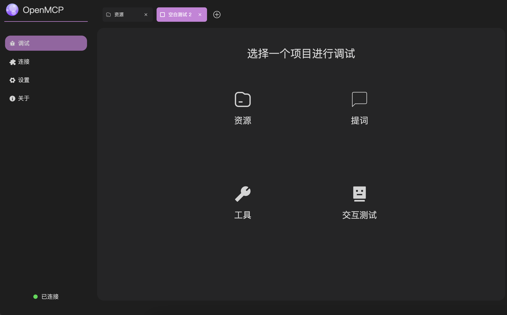

<div align="center">


<h3>OpenMCP: 一体化 MCP Server 调试器</h3>

<a href="https://qm.qq.com/cgi-bin/qm/qr?k=C6ZUTZvfqWoI12lWe7L93cWa1hUsuVT0&jump_from=webapi&authKey=McW6B1ogTPjPDrCyGttS890tMZGQ1KB3QLuG4aqVNRaYp4vlTSgf2c6dMcNjMuBD" target="_blank">加入 OpenMCP正式级技术组</a>

<a href="https://qm.qq.com/q/qyVJ189OUg" target="_blank">加入 OpenMCP咖啡厅</a>

<a href="https://qm.qq.com/q/AO0sJS3r7U" target="_blank">加入 OpenMCP正式级宣传组</a>
</div>

## OpenMCP

一款用于 MCP 服务端调试的一体化 vscode 插件。



- 包含原版 Inpsector 的所有功能
- 包含一个简易的用于进行测试的大模型对话 & 执行窗口
- 支持多种大模型


## TODO

- [x] 完成最基本的各类基础设施
- [ ] 支持同时调试多个 MCP Server
- [ ] 支持通过大模型进行在线验证
- [ ] 支持 completion/complete 协议字段
- [ ] 支持 对用户对应服务器的调试工作内容进行保存
- [ ] 高危操作权限确认


## Dev

- `app`: 前端 UI 的定义
- `test`: 测试 `app` 的部分，包含一个简易的转发层
- `src`: vscode 插件端定义

### 初始化环境

```bash
source configure.sh
```

### 启动前端

```bash
cd app
npm run serve
```

### 启动后端 (Test)

```bash
cd test
npm run serve
```