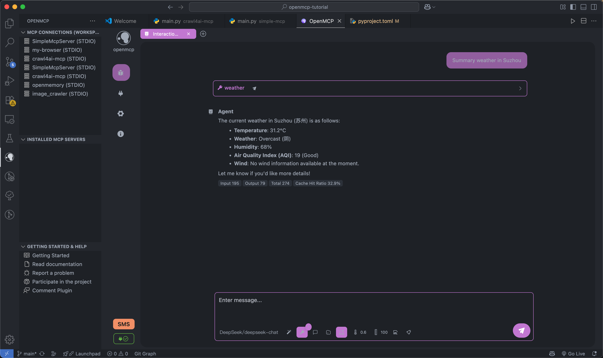

<div align="center">


<h3>OpenMCP: 一体化 MCP Server 调试器</h3>

<a href="https://qm.qq.com/cgi-bin/qm/qr?k=C6ZUTZvfqWoI12lWe7L93cWa1hUsuVT0&jump_from=webapi&authKey=McW6B1ogTPjPDrCyGttS890tMZGQ1KB3QLuG4aqVNRaYp4vlTSgf2c6dMcNjMuBD" target="_blank" style="display: inline-block; padding: 8px 16px; background-color: #CB81DA; color: white; border-radius: .5em; text-decoration: none;">👉 加入 OpenMCP正式级技术组</a>

</div>


## OpenMCP

一款用于 MCP 服务端调试的一体化 vscode/trae 插件。

集成 Inspector + MCP 客户端基础功能，开发测试一体化。


进行资源协议、工具、Prompt 的 MCP 服务器测试。


测试完成的工具可以放入 「交互测试」 模块之间进行大模型交互测试。



支持多种大模型


## TODO

## 需求规划

| 所在模块 | 需求内容 | 功能优先级 | 当前状态 | 修复优先级 |
|---------|---------|--------|---------|-----------|
| `all` | 完成最基本的各类基础设施 | `完整版本` | 100% | `Done` |
| `render` | chat 模式下支持进行成本分析 | `迭代版本` | 100% | `Done` |
| `ext` | 支持基本的 MCP 项目管理 | `迭代版本` | 100% | `P0` |
| `service` | 支持自定义支持 openai 接口协议的大模型接入 | `完整版本` | 100% | `Done` |
| `service` | 支持自定义接口协议的大模型接入 | `MVP` | 0% | `P1` |
| `all` | 支持同时调试多个 MCP Server | `MVP` | 0% | `P1` |
| `all` | 支持通过大模型进行在线验证 | `迭代版本` | 100% | `Done` |
| `all` | 支持对用户对应服务器的调试工作内容进行保存 | `迭代版本` | 100% | `Done` |
| `render` | 高危操作权限确认 | `MVP` | 0% | `P1` |
| `service` | 对于连接的 mcp server 进行热更新 | `MVP` | 0% | `P1` |
| `service` | 系统配置信息云同步 | `MVP` | 0% | `P1` |
| `all` | 系统提示词管理模块 | `迭代版本` | 100% | `Done` |
| `service` | 工具 wise 的日志系统 | `MVP` | 0% | `P1` |
| `service` | 自带 OCR 进行字符识别 | `迭代版本` | 100% | `Done` |


## 项目概念

openmcp 采用分层模块化设计，通过组装不同的模块，可以将它实现成不同平台上的不同模式。

```mermaid
flowchart TD
    subgraph OpenMCP核心组件
        renderer[Renderer]
        openmcpservice[OpenMCPService]
    end

    subgraph OpenMCP_Web["OpenMCP Web"]
        renderer
        openmcpservice
        nginx[Nginx]
    end

    subgraph OpenMCP_插件["OpenMCP 插件"]
        renderer
        openmcpservice
        vscode[VSCode 插件代码]
    end

    subgraph OpenMCP_App["OpenMCP App"]
        renderer
        openmcpservice
        electron[Electron 代码]
    end

    subgraph QQ机器人["基于 OpenMCP 的 QQ 机器人"]
        lagrange[Lagrange.OneBot]
        openmcpservice
    end

    %% 依赖关系
    OpenMCP_Web -->|前端渲染| renderer
    OpenMCP_Web -->|后端服务| openmcpservice
    OpenMCP_Web -->|反向代理| nginx

    OpenMCP_插件 -->|UI 界面| renderer
    OpenMCP_插件 -->|核心逻辑| openmcpservice
    OpenMCP_插件 -->|集成开发| vscode

    OpenMCP_App -->|前端界面| renderer
    OpenMCP_App -->|本地服务| openmcpservice
    OpenMCP_App -->|桌面封装| electron

    QQ机器人 -->|协议适配| lagrange
    QQ机器人 -->|业务逻辑| openmcpservice
```


---

## Dev

- `renderer`: 前端 UI 的定义
- `service`: 测试 `renderer` 的部分，包含一个简易的转发层
- `src`: vscode 插件端定义

### Renderer & Service Dev


配置项目

```bash
## linux
./configure.sh
## windows
./configure.ps1
```

启动 dev server

```bash
## linux
./dev.sh
## windows
./dev.ps1
```

> 端口占用： 8080 (renderer) + 8081 (service)

### Extention Dev


负载部署
```bash
## linux 
./build_service.sh

## windows
./build_service.ps1
```

and just press f5, いただきます